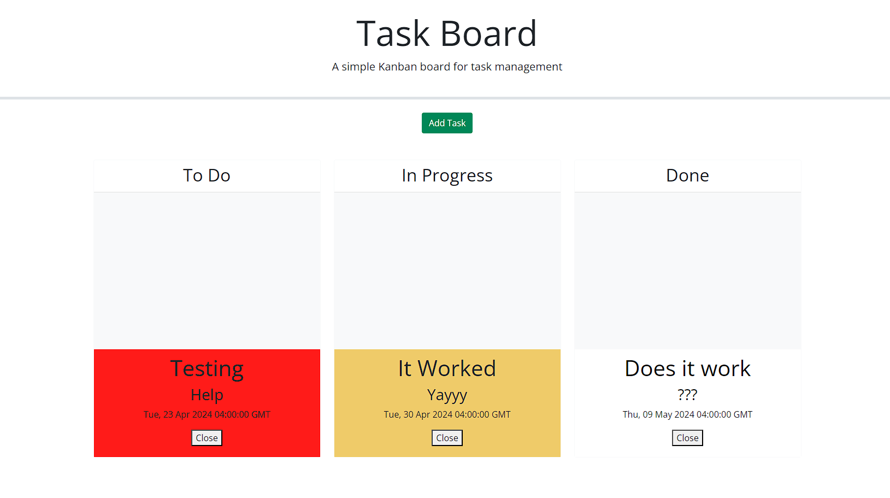

# Kanban-List

App Description:
Created a Kanban List allowing the user to add a task and set due date
Cards are color coded based on the due date and reset in color once task is completed
Tasks are saved in local storage and load when page loads

Link to deployed page:
https://drauf727.github.io/Kanban-List/

Link to GitHub repository:
https://github.com/drauf727/Kanban-List

Photo of working app:

